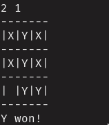

# t3asm
## Description
A lightweight, terminal-based implementation of the classic Tic Tac Toe game written in 64-bit Netwide Assembler. All I/O operations are done via [64 bit Linux Kernel syscalls](https://chromium.googlesource.com/chromiumos/docs/+/master/constants/syscalls.md#x86_64-64_bit)



## Compilation
```
$ ./run.sh
```
